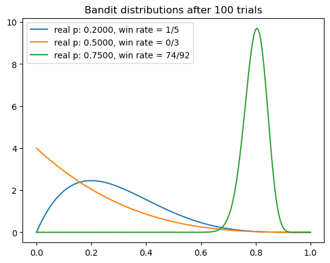
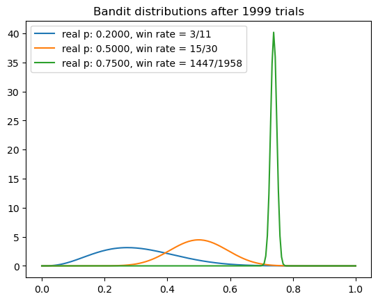
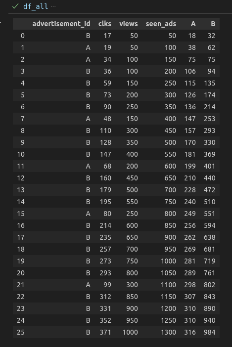
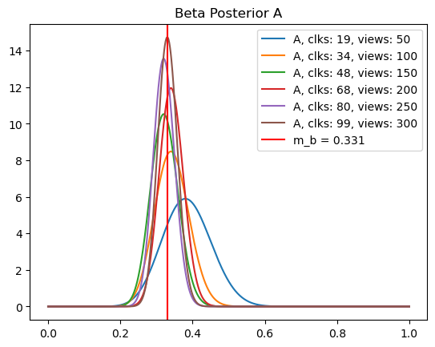
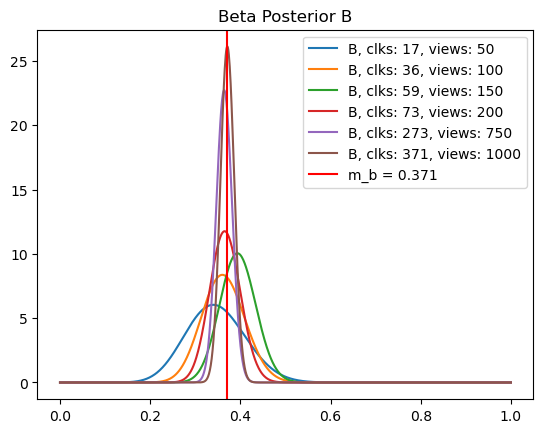
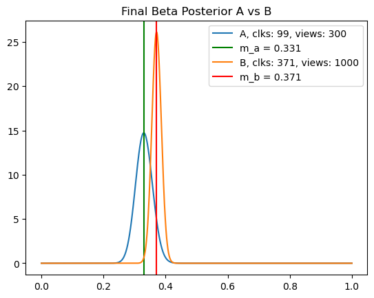

Пишу этот текст по итогам прохождения курса [Bayesian Machine Learning in Python: A/B Testing](https://deeplearningcourses.com/c/bayesian-machine-learning-in-python-ab-testing). Курс посвящён Байесовскому подходу в машинном обучении.  

Разберу идеи, необходимые для реализации алгоритма Thompson sampling. Сама реализация очень проста, но вот идеи стоящие за ним требуют глубокого осмысления.


### Область применения. Зачем нужно А/В тестирование?
Количественное сравнение вещей. В ситуациях когда требуется сделать выбор из двух и более опций.
Например:
- что бы выбрать между двумя рекламами, нужно сравнить их CTR. $CTR=\frac{cliks}{impressions}$ 
- как это сделать? 
- провести эксперимент.
- как понять сколько раз нужно показывать рекламу что бы утверждать что реклама А лучше рекламы В?  Чем больше показов тем больше уверенность. 
- если одна реклама лучше, то другая хуже.
- соответсвенно мы хотим показывать только оптимальную рекламу, что бы заработать больше денег.
- это желание противоречит дизайну эксперимента и точной оценке CRT
### Explore - Exploit Dilemma

Действуют две противоположные силы:

1. для ответа на вопрос нужно собирать данные — исследование (Exploration)
2. выбирать вариант с самой большой пропорцией успеха — эксплуатация (Exploitation)

Дилемма сводится к поиску баланса между исследованием окружения для определения максимально выгодных действий, и выбором лучшего действия настолько часто насколько это возможно.


### Multi-Armed Bandit Problem

Классический пример модели этой дилемы — проблема многорукого бандита. Можно представить как несколько одноруких бандитов. Как выдлядит игра? Дёргаем ручку бандита, получаем результат {0, 1}.  Каждый бандит имеет свою пропорцию успехов.   Нужно исследовать бандитов, и в то же время совершеть максимально выгодные действия исходя из текущих знаний о бандитах. 

Поскольку пропорции успаха бандитов нам не известны, мы можем рассматривать их как случайные величины. Следовательно они имеют распределения. 
$\{B_1, ... , B_K\}$ — К бандтов,  и связанные с ними распределения:
$$\{\mu_1,...,\mu_K\},\ \{\sigma^2_1,...,\sigma^2_K\}$$
На каждом шаге игры $t=1,2...$ игрок выбирает бандита $j(t)$, играет и получает вознаграждение $r(t) \sim B_{j(t)}$. Вознаграждение может быть непрерывной величиной. Сейчас рассматривем простой случай — выиграл или проиграл {0, 1}.  Игрок преследует две цели. С одной стороны ему нужно вычислить бандита с наибольшим мат ожиданием успеха, с другой выиграть как можно больше денег. Алгоритм определяет стратегию по которой игрок должен выбирать бандита $j(t)$.

В примере с выбором рекламы. Имеем два бандита А и В с неизвестными пропорциями успехов. Показываем посетитителю сайта рекламу. Получаем reward —  либо кликнул либо нет. Та же ситуация что и с броском монетки, только не известна вероятность заложенная в монету.  Клики распределены по Бернулли.

### Байесовский подход

Суть. Мы не формируем свои представления с чистого листа, а изменяем их под действием новых доказательств (данных, результатов эксперимента). Изначально априорная гипотеза выдвигается на основе того что мы знаем о предметной области до начала эксперимента (поступления данных). После каждой игры, мы обновляем свои знания о бандите. Нужно сместить распределение. Использовать результат игры, что бы получить постериорное распределение из априорного.


Переформулируем проблему:
$$P(\theta|X)=\frac{p(X|\theta)P(\theta)}{P(X)}$$
здесь:
$\theta$ — это среднее значение пропорции успеха, распределённой по Бернулли.
X — в зависимости от контекста, либо случайная величина, либо данные которые мы собрали.
$P(\theta|X)$ — Апостериорная вероятность
$P(X|\theta)$ — Правдоподобие (Likelihood)
$P(\theta)$ — Априорная вероятность. 
$P(X)$ — Evidence. Нормализация, что бы из правдоподобия получить вероятность.
Знаменатель обычно не известен и в случае непрерывной величины это интеграл который очень сложно вычислить. Он нужен что бы интеграл от pdf по всей области определения равнялся единице. Поскольку $P(X)$ это константа —  вся площадь под кривой. 
Равенство можно заменить на пропорцию:
$$P(\theta|X)\propto{p(X|\theta)P(\theta)}$$
### Сопряженныe распределения

Главный трюк Байесовской статистики.
- это такие пары распределений, что мы можем игнорировать $P(X)$ 
- $P(\theta|X)$ и $P(\theta)$ — сопряжённые распределения, если априорное распределение является сопряжённым для правдоподобия. (Conjugate Prior)
- можно получать апостериорное распределение из априорного и новых данных.

В данном случае имеем правдоподобие Бернулли:
$$X = \{x_1,x_2,...,x_n\}$$
$$p(X|\theta)=\prod_{i=1}^Np(x_i|\theta)=\prod_{i=1}^N{\theta^{x_i}(1-\theta)^{1-x_i}}, x_i\sim Bernoulli(\theta)$$

**Beta распределение является сопряжённым априорным распределением для правдоподобия Бернулли. (Conjugate Prior)**

Ищем формулу для обновления апостериорного распределения бандита. 
Beta распределение в общем виде :
$$f(x)=\frac{x^{\alpha-1}(1-x)^{\beta-1}}{B(\alpha,\beta)}$$
$$f(\theta;\alpha,\beta)=const*\theta^{\alpha-1}(1-\theta)^{\beta-1}$$
Получим апостериорное Beta распределение из априорного и правдоподобия:
$$P(\theta|X)\propto{p(X|\theta)P(\theta)}=(\prod_{i=1}^N{\theta^{x_i}(1-\theta)^{1-x_i}})(\frac{1}{B(\alpha,\beta)}\theta^{\alpha-1}(1-\theta)^{\beta-1})$$
Поскольку $B(\alpha,\beta)$ является константой для конкретного  $\theta$, она не влияет на пропорцию
$$\propto(\prod_{i=1}^N{\theta^{x_i}(1-\theta)^{1-x_i}})(\theta^{\alpha-1}(1-\theta)^{\beta-1})$$
Переведём произведение в сумму. $\theta^{x_1}\theta^{x_2}...\theta^{x_N}=\theta^{x_1+x_2+...x_N}=\theta^{\sum{x_i}}$  
$$=\theta^{\sum{x_i}}(1-\theta)^{\sum{1-x_i}}(\theta^{\alpha-1}(1-\theta)^{\beta-1})$$
$$p(\theta|X)\propto \theta^{\alpha-1+\sum x_i} (1-\theta)^{\beta-1+\sum(1-x_i)}$$
Ещё раз сравним Beta в общем виде с тем что получилось после преобразований:
$$f(\theta;\alpha,\beta)=const*\theta^{\alpha-1}(1-\theta)^{\beta-1}$$
$$p(\theta|X)\propto \theta^{\alpha-1+\sum x_i} (1-\theta)^{\beta-1+\sum(1-x_i)}$$
Константа здесь не важна. она нужна только для того что бы интеграл по всей области определения pdf равнялся 1.


Сопряжённое распределение $p(\theta|X)$ для априорного распределения $Beta(\alpha, \beta)$:
$$p(\theta|X)=Beta(\alpha+\sum_{i=1}^Nx_i, \beta+N-\sum_{i=1}^Nx_i),$$
$$если\ p(\theta)=Beta(\alpha,\beta)$$
**Как этим пользоваться?**

В коде бандита мы обновляем $P(\theta|X)$ на каждом шаге. $P(\theta|X)$ на текущем шаге является $P(\theta)$ для следующего шага. N=1 всегда. Обновляем параметры распределения бандита. 
```python
def update(self, reward):
	self.a += reward
	self.b = self.b + 1 - reward
```


### Выбор априорного распределения.

Beta распределение определяется параматрами $\alpha$ и $\beta$. $Beta(1, 1)$ задаёт равномерное распределение на отрезке [0, 1]. Это значит что мы ничего не знаем про $P(\theta)$. Если есть априорные знания в предметной области, например CTR ~ 1%, то они должны быть закодированы в априорном распределении.

### Идея алгоритма Thompson sampling

В процессе игры строим распределение пропорции успехов для каждого бандита. Для этого используем результаты игры. Эти распределения отражают наши представления о том где находится истинное значение пропорции успехов каждого бандита. Теоретически оно может быть где угодно, но области с большей плотностью вероятности, более вероятны.

На каждом шаге алгоритма, что бы совершить лучший выбор, используем накопленные знания о бандитах — из каждого распределения вибираем значение. Играем с бандитом, вернувшим максимальное значение случайной величины. Используя результат игры, обновляем распределение бандита.

Чем ближе распределение оптимального бандита к его инстинному распределению, тем выше вероятность, что выбранное действие будет оптимально.  Когда распределения сформированы алгоритм защищает нас от игры с неоптимальным бандитом. 

### Симуляция vs "реальные данные"

Перед тем как перейти к реализации, нужно понять где брать данные для проверки работы алгоритма. тезисы такие:
- Нет возможности запустить свой сайт и нагнать туда тысячи пользователей, что бы просто проверить свои навыки и работу алгоритма.
- Проще всего тестировать алгоритмы на синтетических данных. Работа алгоритма не зависит от того синтетические это данные или "реальные".
- Симуляция позволяет проверить работу алгоритма, поскольку известен ответ. С реальными данными это не возможно, потому что не известна истинная вероятность клика. Человек который кликает на рекламу, тоже этого не скажет.
- Симуляции позволяют нам визуализировать данные, понять что происходит и проверить алгоритм. Этот метод позволяет нам обучиться.
- Эта история справедлива для всего машинного обучения. Достаточно посмотреть в google картинки по запросу linear classification.
- All data is the same

### Простая реализация.

Класс бандит содержит истинное значение пропорции. На его основе, метод pull генерирует результат игры (reward). Конечно в реальной ситуации такого не будет. Ведь именно пропорцию успехов мы и ищем. Но симуляция тем и хороша, что мы знаем ответ и можем проверить работу алгоритма . В конструкторе инициализируем Beta распределение параметрами a = 1, b = 1 — нет априорных знаний.  Метод sample возвращает значение случайной величины из текущего распределения бандита. Метод update сдвигает распределение — обновляет параметры по формуле, полученной выше.

```python
class Bandit:
	def __init__(self, p):
		self.true_p = p
		self.a = 1
		self.b = 1 

	def pull(self):
		return np.random.random() < self.true_p 

	def sample(self):
		return beta.rvs(self.a, self.b)  

	def update(self, x):
		self.a += x
		self.b = self.b + 1 - x
```

Код ниже создает три экземпляра класса Bandit. Закладывает в них разные верояности, и находит их с помощью алгоритма Thompson sampling.

```python
NUM_TRIALS = 2000
BANDIT_PROBABILITIES = [0.2, 0.5, 0.75]

def experiment():
	bandits = [Bandit(p) for p in BANDIT_PROBABILITIES]
	for i in range(NUM_TRIALS):
		# Выбор бандита. Thompson sampling		
		j = np.argmax([b.sample() for b in bandits])		
		# играем с бандитом который вернул максимальное значение
		x = bandits[j].pull()		
		# обновить параметры распределения выбранного бандита
		bandits[j].update(x)
```

Посмотрим как меняются распределения бандитов в течении эксперимента.
Вот интересный график:



Оценка среднего для рыжего бандита в нуле — ни одного выигрыша в трёх попытках. Синий бандит — оценка отодвинулась от нуля, потому что удалось выиграть один раз и пяти. У зелёного — оптимального бандита оценка левее единицы — потому что уже есть проигрыши.



Распределения после 2000 попыток. Для зелёного и жёлтого бандитов оценка пропорции успеха совпала с её истинным начением.  Синий бандит с самой маленкой пропорцией не до конца исследован. На графике зелёного бандита видим узкий пик, он находится правее двух других бандитов. Значения случайных величин, выбранные из этого распределения будут всегда больше значений взятых из двух других. Теперь алгоритм всегла будет выбирать оптимального бандита.

### Сравнение частотным методом 

Рассмотрим два самых интересных, на мой взгляд, задания. Файл [файл](https://github.com/lazyprogrammer/machine_learning_examples/blob/master/ab_testing/advertisement_clicks.csv) содержит данные о результатах рекламных компаний А и В. Пользователь кликнул на рекламу — 1, если нет — 0. Данные из этого файла можно использовать как для классического а/в теста, так и подавать на Thompson sampling алгоритм. Это позволит сравнить подходы и результат.

### Классический тест

**Ответить на вопрос:** есть ли статистически значимая разница в CTR между рекламными компаниями А и В. Принять уровень статистической значимости $\alpha=0.05$

```python
A = df[df["advertisement_id"] == "A"]["action"].to_numpy() 
B = df[df["advertisement_id"] == "B"]["action"].to_numpy()
```
Пусть $Y=\{0,1\}$  — случайная величина распределённая по Бернулли. 
здесь 1 — это успех пользователь кликнул на рекламу.  Количество показов рекламы для групп А и В одинаково. $n_A=n_B=n=1000$. Случайные переменные $X_A$ и $X_B$ —  это cумма успехов в каждой группе после 1000 попыток. $X_A=Y_1+Y_2+...+Y_n$

$$\mu_{X_A}=E(X_A)=E(\sum_{i=1}^nY_i)=nE(Y)=np_A$$

$$\sigma_{X_A}^2=Var(X_A)=nVar(Y)=np_A(1-p_A)$$

$p_A$ —  популяционный параметр (пропорция) для всех кто кликнул на рекламу А. 
$\hat{p}_A$ —  выборочная пропорция выборки $X_A$.

$$\hat{p}_A = \frac{количество\mspace{4mu}успехов \ в\ А}{размер\ выборки\ А}$$   
$$\hat{p}_A=\frac{X_A}{n}=\frac{304}{1000}$$

```python
p_a = A.mean()
p_b = B.mean()
n * p_a # 304.0
```
Здесь легко запутаться. Клики распределены по Бернулли. Количество успехов в выборке размером n распределено биномиально. По центральной теореме о пределах (CLT) распределение сумм, выборочных средних и пропорций с увеличением n приближается к нормальному.

$$\mu_{\hat{p}_A}=E(\frac{X_A}{n})=\frac{1}{n}E(X_A)=\frac{n}{n}p_A=p_A$$

$$\sigma_{\hat{p}_A}^2=\frac{Var{X_A}}{n^2}=\frac{p_A(1-p_A)}{n}$$

$$\hat{p}_A\sim N(p_A,\frac{p_A(1-p_A)}{n})$$

$$\hat{p}_B\sim N(p_B,\frac{p_B(1-p_B)}{n})$$

Пропорции распределены нормально, следовательно разница этих случайных величин тоже будет нормально распределённой случайной величиной. 

$$\mu_{\hat{p}_A-\hat{p}_B}=p_A-p_B$$

$$\hat{p}_A-\hat{p}_B\sim N(p_A-p_B,\frac{p_A(1-p_A)}{n}+\frac{p_B(1-p_B)}{n})$$

Для ответа на вопрос нужен духсторонний тест. Выдвигаем гипотезы.

$$H_0:\hat{p}_A-\hat{p}_B=0$$

$$H_1:\hat{p}_A-\hat{p}_B\neq0$$

Считаем статистику:

$$Z=\frac{\hat{p}_A-\hat{p}_B-0}{\sqrt{\frac{p_A(1-p_A)}{n}+\frac{p_B(1-p_B)}{n}}}$$

```python
s2_a = p_a * (1 - p_a) / N
s2_b = p_b * (1 - p_b) / N
SE = np.sqrt(s2_a + s2_b)
z = (p_a - p_b - 0) / SE
pr = 1 - norm.cdf(np.abs(z))
pl = norm.cdf(-np.abs(z))
p_value = pr + pl

print(f"p: {p_value}, z: {z}")
```
p: 0.0012695079898108496, z: -3.2227850093563326

```python
if p_value < alpha:
	print("Reject the H0")
else:
	print("Fail to reject the H0")
```

Собрано достаточно доказательств что бы отвегнуть гипотезу $H_0$.
**Ответ:** есть статистически значимая разница между коиличеством кликов на рекламу А и В.

Сравним с библиотечным t-тестом. Проведём двухсторонний тест. Гипотезы те же.

```python
t, p_value = stats.ttest_ind(A, B, alternative='two-sided')
print(f"t: {t} p: {p_value}")
```
t: -3.221173213801978 p: 0.001297190546712528
Результат тот же. Отвергаем гипотезу $H_0$. Есть статистически значимая разница.

Рассмотрим два оставшихся варианта. Гитотеза $H_0$ во всех случаях остается таже. Проведём односторонний тест:
$$H_1:\hat{p}_A\ge\hat{p}_B,\ \hat{p}_A-\hat{p}_B\ge0$$
```python
t, p_value = stats.ttest_ind(A, B, alternative='greater')
print(f"t: {t} p: {p_value}")
```
t: -3.221173213801978 p: 0.9993514047266437
Получили p_value > alpha (0.99 > 0.05). Недостаточно данных, что бы отвергнуть гипотезу $H_0$.

Последний вариант:
$$H_1:\hat{p}_A\le\hat{p}_B,\ \hat{p}_A-\hat{p}_B\le0$$
```python
t, p_value = stats.ttest_ind(A, B, alternative='less')
```
t: -3.221173213801978 p: 0.000648595273356264
p_value < alpha. Отвергаем гипотезу $H_0$. Можно утверждать что реклама B лучше рекламы A.
### Клиент серверная симуляция (Thompson sampling ).

В конце курса предложено задание, разделить реализацию на клиентскую и cерверную часть. Я делал его на основе [заготовки](https://github.com/lazyprogrammer/machine_learning_examples/blob/master/ab_testing/server_starter.py), написанной автором. На стороне сервера реализован алгоритм Thompson sampling, методы get_ad, click_ad. Используем тот же [файл](https://github.com/lazyprogrammer/machine_learning_examples/blob/master/ab_testing/advertisement_clicks.csv) для имитации поведения пользователей на сайте.[Клиентский скрипт](https://github.com/lazyprogrammer/machine_learning_examples/blob/master/ab_testing/client.py) запрашиват показ рекламы, смотрит файл, если на текщем шаге для полученной рекламы стоит 1, скрипт постит клик на сервер. Сервер принимает клик, обновляет распределение бандита и продолжает управлять выдачей рекламы на основе текущих представлений о том какая из них лучше.  Это происходит до тех пор пока в файле не закончатся действия для какой либо из реклам. Для оптимальной рекламы это произойдёт быстрее. [Моё решение](server_starter.py) немного отличается от [решения автора](https://github.com/lazyprogrammer/machine_learning_examples/blob/master/ab_testing/server_solution.py) Отличие заключается в реализации обновления распределения. Автор накапливает просмотры и клики в соответствующих переменных и с их помощью обновляет параметры Beta распределения. Делает это в методе sample, котрый вызывается при выборе рекламы.

```python
def sample(self):
	# Beta(1, 1) is the prior
	a = 1 + self.clks
	b = 1 + self.views - self.clks
	return np.random.beta(a, b)
```

В моём варианте методы update и sample разделены. Параметры Beta распределения инициализируются в конструкторе a = 1, b =1. click = {0, 1}

```python
def update(self, click):
	self.a += click
	self.b += 1 - click

def sample(self):
	return beta.rvs(self.a, self.b)
```

Отсюда и все прочие различия в коде. Результат конечно одинаковый.

Добавил код, выводящий в файл, логи клиента и сервера. Первые три столбца это логи сервера. Через каждые 50 показов рекламы, соответствующий бандит выводит сколько было показов и сколько кликов. Оставшиеся три столбца это клиентская сторона. При достижении количества просмотров кратного 50, клиент записывает сколько всего видел рекламы и какой.



Посмотрим как формировалось Beta распределение бандита А. График обновляется после каждых 50 показов рекламы А. Чем больше показов, тем уже купол и больше уверенность в оценке. Среднее приближается к истинному значению.



Показов рекламы В было гораздо больше — 1000. На график вывел не все промежуточные варианты. 



К какому результату пришёл алгоритм. Вот распределения банидитов А и В на момент остановки.



Алгоритм выбирает какую рекламу показывать на основе количества кликов полученных от предыдущих показов реклам. В случае продолжения эксперимента, решение о том какую рекламу показывать, принималось бы на основании выборки из этих двух распределений, и распределения продолжили бы меняться. Средние значения продолжили бы приближаться к своим истинным значениям (А - 0.304, В -  0.372), а купола становились бы всё уже. С определённого момента, алгоритм начал бы выбирать только оптимального бандита.

О чём ещё можно подумать?
```python
all_clks = a["clks"].max() + b["clks"].max()
all_views = a["views"].max() + b["views"].max()
print(f'всего получили {all_clks} кликов из {all_views} показов реклам А и В.')
print(f'сколько кликов могли бы получить:{0.372 * all_views}')
```

Всего получили 470 кликов из 1300 показов реклам А и В. (0.362%). Если бы показывали только оптимальную рекламу, количество успехов могло быть  равно:
$$\mu_{X_B}=np_B = 1300*0.372=483.6$$
Ожидаемые потери (regret) от того что алгоритм не всегда играет выбирает оптимальный вариант составили 483 - 470 = 13 кликов, при 1300 показах.
### Ещё пример использования

Что бы продавать нужен хороший сайт. Хороший сайт привлекает пользователей, клики, подписки, покупки. Допустим есть два дизайна страницы. Нужно понять какой из них лучше. Нужно определить что значати лучше. Пусть лучшим считается дизайн страницы с большей конверсией подписок. Например,  конверсия = 30 подписок / 100 визитов = 30%. Теперь нужно показать оба дизайна достаточно большому количеству посетителей, что бы быть уверенным в конверсии. В то же время мы не хотим показывать не оптимальный дизайн слишком часто. Опять дилемма. 
- Исследование = сбор данных
- Использование = показ дизайна с большей конверсией.

### Выводы

Для использования частотного метода сначала нужно собрать данные, потом делать выводы. Сбор данных не бесплатный. Байесовский подход позволяет использовать потоковые данные для принятия решений. И не приходится иметь дело с этой странной терминологией "не достаточно данных что бы отвергнуть гипотезу".


