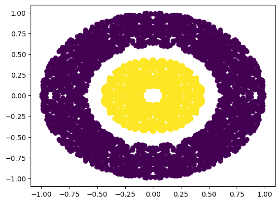

проверка формул

$$\hat{p}_A\sim N(p_A,\sqrt{\frac{p_A(1-p_A)}{n}})$$


картинка:



Пример вставки кода:

```python
class MyBandit:

	def __init__(self, tp) -> None:	
		self.N = 0
		self.p_estimated = 0	
		self.true_p = tp
	
	def pull(self):
		return np.random.binomial(n=1, p=self.true_p) 

	def update(self, x):
		self.N += 1
		self.p_estimated = self.p_estimated + (x - self.p_estimated) / self.N

	def ucb1(self, n):
		return self.p_estimated + np.sqrt(2 * np.log(n) / self.N)
```